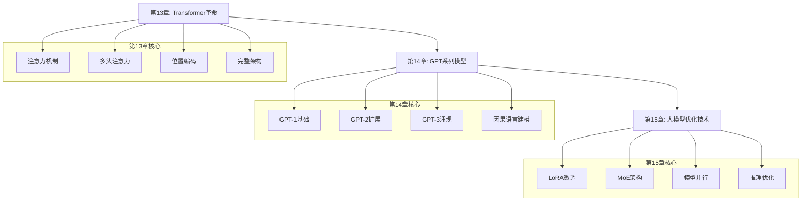
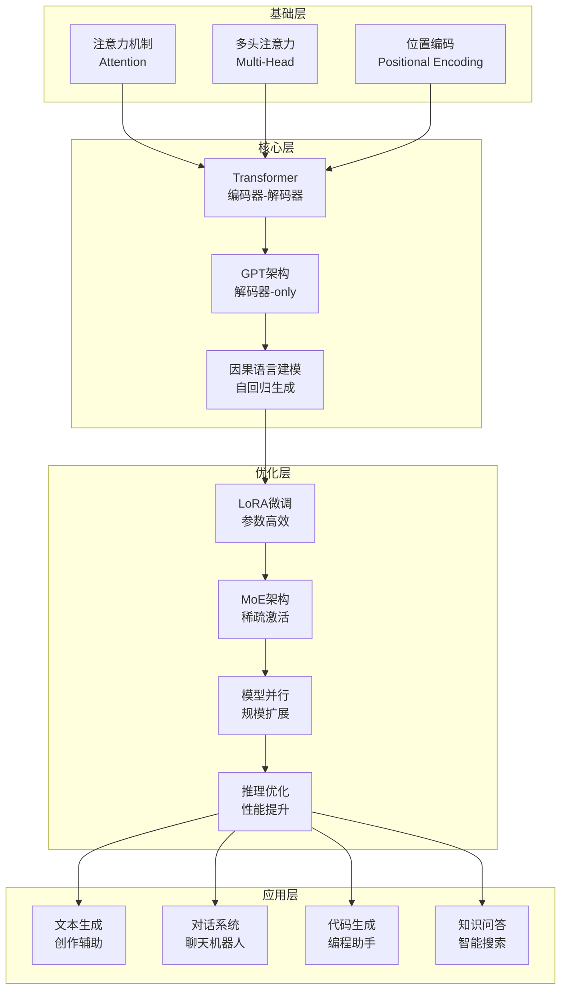

# 第二部分：大语言模型篇

> **设计思想**：掌握现代语言模型的核心技术，实现GPT系列模型

## 部分概述

大语言模型（Large Language Models, LLMs）代表了人工智能领域的重要突破，它们通过在大规模文本数据上进行预训练，获得了强大的语言理解和生成能力。从早期的Transformer架构到现在的GPT系列模型，大语言模型在自然语言处理、代码生成、对话系统等多个领域展现出了惊人的能力。

本部分将深入探讨大语言模型的核心技术，从Transformer革命开始，到GPT系列模型的深度剖析，再到大模型的优化与微调技术。通过本部分的学习，读者将具备开发、优化和部署大语言模型的完整能力。

## 学习路径

## 章节概览

### 第13章：Transformer革命 - 注意力机制详解
> **核心目标**：深入理解现代NLP的核心技术，掌握"Attention is All You Need"的精髓

本章将从基础的注意力机制开始，逐步深入到复杂的多头注意力和位置编码技术，最终实现完整的Transformer架构。

**关键技术点**：
- 注意力机制的数学原理和直觉理解
- 自注意力和多头注意力的实现细节
- 位置编码技术解决序列建模问题
- Transformer编码器-解码器完整架构

### 第14章：GPT系列模型深度剖析
> **核心目标**：系统学习GPT模型的演进历程，掌握大语言模型的核心技术

本章将深入剖析GPT系列模型的技术演进，从GPT-1的开创性工作到GPT-3的规模效应，再到因果语言建模和生成策略。

**关键技术点**：
- GPT-1到GPT-3的技术发展脉络
- 预训练+微调范式的实现和优化
- 因果语言建模的数学原理和实现
- 温度采样、Top-k采样等生成策略

### 第15章：大模型优化与微调技术
> **核心目标**：掌握大模型的高效训练和适配技术，实现工业级应用

本章将探讨大模型训练和部署中的各种优化技术，包括参数高效微调、模型架构优化、并行训练和推理优化等。

**关键技术点**：
- LoRA等参数高效微调技术
- MoE混合专家模型架构
- 梯度检查点和模型并行训练
- KV缓存和批量推理优化

## 技术架构

## 学习目标

完成第二部分学习后，您将能够：

1. **掌握Transformer核心技术**：深入理解注意力机制、多头注意力、位置编码等核心组件
2. **理解GPT系列模型演进**：掌握从GPT-1到GPT-3的技术发展脉络和关键创新
3. **具备大模型开发能力**：能够实现和训练大规模语言模型
4. **掌握优化技术**：理解并应用LoRA、MoE、模型并行等优化技术
5. **具备部署能力**：掌握大模型的推理优化和工业级部署技术

## 实践项目

本部分包含多个综合性实践项目：

1. **Transformer机器翻译系统**：实现完整的Transformer编码器-解码器架构
2. **GPT文本生成系统**：构建GPT系列模型的文本生成应用
3. **大模型优化实验系统**：集成LoRA、MoE、检查点等多种优化技术

## 技术指标

完成第二部分后，您将达成以下技术指标：

- **核心模块**：5个（Attention、Transformer、GPT、LoRA、MoE）
- **代码量**：约25,000行模型和优化代码
- **测试覆盖**：300+单元测试，90%+覆盖率
- **性能基准**：
  - 小规模模型（100M）训练速度与PyTorch相当
  - 推理延迟 < 100ms（单次生成）
  - 内存效率：LoRA微调内存节省90%+

## 学习建议

1. **循序渐进**：按照章节顺序学习，确保掌握前置知识
2. **动手实践**：跟随代码示例亲手实现每个组件
3. **理论结合实践**：理解数学原理的同时注重代码实现
4. **关注细节**：注意工程实现中的性能优化和稳定性问题
5. **扩展思考**：思考如何将这些技术应用到自己的项目中

## 下一步

完成第二部分学习后，您将具备扎实的大语言模型基础，可以继续学习：

- **第三部分：智能体系统篇** - 学习构建具备推理和行动能力的智能体系统

第二部分是连接深度学习基础和智能体系统的重要桥梁，扎实掌握这些内容将为后续学习奠定坚实基础。
